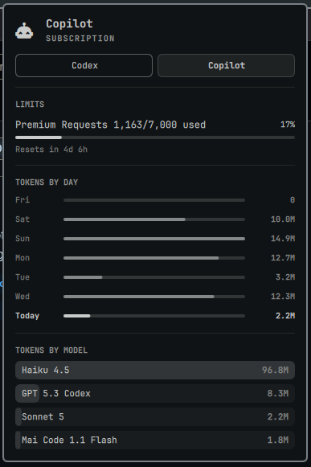

# Copilot Panel Usage Plugin

Displays Copilot usage and quota in the Omarchy agents panel.



## Install

```bash
omarchy plugin add https://github.com/wellatleastitried/omarchy-copilot-panel-usage.git --enable
```

## Uninstall

```bash
omarchy plugin remove wellatleastitried.copilot-panel-usage
```

## Requirements

- **Python 3.10+**
- **Copilot CLI** installed with session history at `~/.copilot/session-store.db`
- **Optional:** Editor OAuth tokens for quota display (VS Code, JetBrains, or copilot.vim plugin)

## Overview

>Note: This plugin was built from [my PR](https://github.com/basecamp/omarchy/pull/7798) that is open in Omarchy. If this PR is merged, this plugin will no longer be supported.

Shows token usage by model, active days, and current quota limits. Reads from Copilot CLI's local session store and fetches quota from GitHub's API (requires editor OAuth tokens).

Data updates every 5 minutes or when you refresh the agents panel.

## License

[MIT](./LICENSE)
